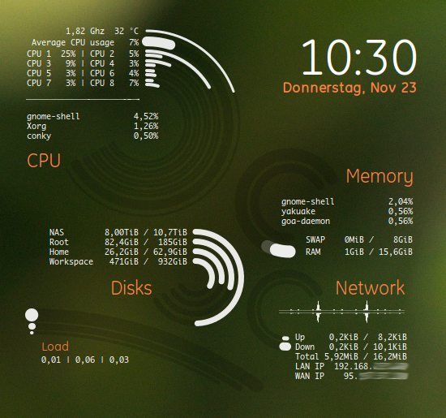
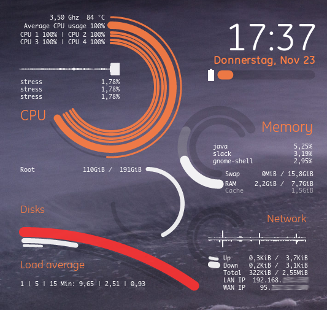
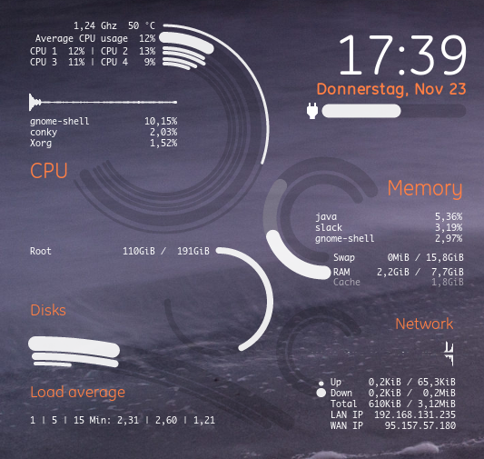
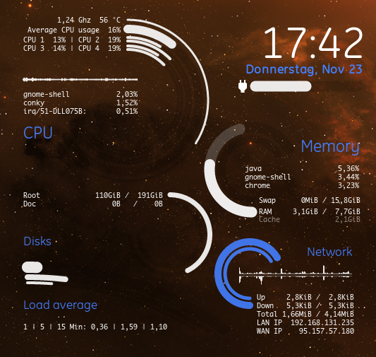

# miracle-conky

In this project I share my conky configuration. You can fork it and adjust these scripts to your needs.

## Whats the difference

In many conky configurations you find the old style configuration and can't make it really dynamically. Even
with the new lua configuration scripts you can not make it dynamically to the current status of your
environment. The configuration script is only executed at the beginning and when it gets changed.

So the result was to have everything in the lua hook (text, icons, graphs, bars). The reason for this script
was to have the same configuration file on each machine (desktop, notebook). It automatically detects the
amound of cpu cores, the network, the network speed, the mounted drives and if a battery is available.

## Requirements

This conky configuration needs a conky with lua support and the libraries cairo and imlib2.

I tested, developed and using it with gnome 3.26 in manjaro linux using the package `conky-lua-nv`.

## Install

Clone or download this repository and execute the `start.sh`.

## Screenshots

  
  
  
  

## License

This configuration is shared under [MIT License](LICENSE). You can share and redistribute.

The Icons used for the battery bar are from [Material Icons](https://github.com/google/material-design-icons/)
- thanks to the contributors.
